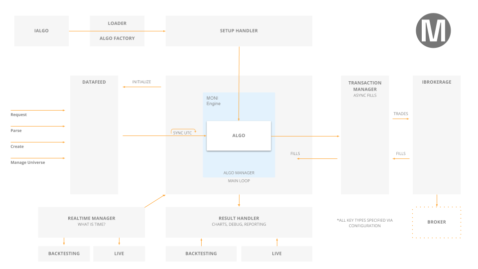

  

=========

 &nbsp;&nbsp;&nbsp;  &nbsp;&nbsp;&nbsp; 

[Monilar Home][1] | [Documentation][2] | [Download Zip][3]
 
----------

## Introduction ##

MONI Engine is an algorithmic trading engine built for easy strategy research, backtesting and live trading.

The core of the MONI Engine is written in C#. It supports algorithms written in Python 3.8 or C#. Monilar drives the web-based algorithmic trading platform [Monilar Web Interface][4].

## System Overview ##

The Engine is broken into many modular pieces which can be extended without touching other files. The modules are configured in config.json as set "environments". Through these environments, you can control Monilar to operate in the mode required. 

The most important plugins are:

 - **Result Processing** (IResultHandler)
   > Handle all messages from the algorithmic trading engine. Decide what should be sent, and where the messages should go. The result processing system can send messages to a local GUI, or the web interface.

 - **Datafeed Sourcing** (IDataFeed)
   > Connect and download the data required for the algorithmic trading engine. For backtesting this sources files from the disk, for live trading, it connects to a stream and generates the data objects.

 - **Transaction Processing** (ITransactionHandler)
   > Process new order requests; either using the fill models provided by the algorithm or with an actual brokerage. Send the processed orders back to the algorithm's portfolio to be filled.

 - **Realtime Event Management** (IRealtimeHandler)
   > Generate real-time events - such as the end of day events. Trigger callbacks to real-time event handlers. For backtesting, this is mocked-up to work on simulated time. 
 
 - **Algorithm State Setup** (ISetupHandler)
   > Configure the algorithm cash, portfolio and data requested. Initialize all state parameters required.

These are all configurable from the config.json file in the Launcher Project.

## Developing with Visual Studio Code Dev Containers

The [Dev Containers](https://marketplace.visualstudio.com/items?itemName=ms-vscode-remote.remote-containers) extension lets you use a Docker container as a full-featured development environment. The extension starts (or attaches to) a development container running the _quantconnect/research:latest_ image. 

A full explanation of developing Monilar with Visual Studio Code Dev Containers can be found in the [VS Code Integration](https://github.com/monilarcom/Moni/tree/master/.vscode#readme) project.

## Using MONI ##

Monilar recommends using [Monilar CLI](https://monilar.com). This is because it is great for working with your algorithms while still being able to deploy to the cloud and have access to Monilar data.

Reference QuantConnects documentation on Monilar CLI [here](https://monilar.com)

## Issues and Feature Requests ##

Please submit bugs and feature requests as an issue to the [Monilar Repository][5]. Before submitting an issue please read others to ensure it is not a duplicate.

## Contributors and Pull Requests ##

Contributions are warmly very welcomed but we ask you to read the existing code to see how it is formatted, commented and ensure contributions match the existing style. All code submissions must include accompanying tests. You can contact us through support@monilar.com anytime if you have any questions on mind.

A huge thank-you all our contributors!

## Acknowledgements ##

The algorithmic AI engine Monilar would not have been possible without the support of the Pioneers. The Pioneers formed the core 100 early adopters of Monilar who subscribed and allowed us to bring the project into the life. 

Ryan H, Pravin B, Jimmie B, Nick C, Sam C, Mattias S, Michael H, Mark M, Madhan, Paul R, Nik M, Scott Y, BinaryExecutor.com, Tadas T, Matt B, Binumon P, Zyron, Mike O, TC, Luigi, Lester Z, Andreas H, Eugene K, Hugo P, Robert N, Christofer O, Ramesh L, Nicholas S, Jonathan E, Marc R, Raghav N, Marcus, Hakan D, Sergey M, Peter McE, Jim M, INTJCapital.com, Richard E, Dominik, John L, H. Orlandella, Stephen L, Risto K, E.Subasi, Peter W, Hui Z, Ross F, Archibald112, MooMooForex.com, Jae S, Eric S, Marco D, Jerome B, James B. Crocker, David Lypka, Edward T, Charlie Guse, Thomas D, Jordan I, Mark S, Bengt K, Marc D, Al C, Jan W, Ero C, Eranmn, Mitchell S, Helmuth V, Michael M, Jeremy P, PVS78, Ross D, Sergey K, John Grover, Fahiz Y, George L.Z., Craig E, Sean S, Brad G, Dennis H, Camila C, Egor U, David T, Cameron W, Napoleon Hernandez, Keeshen A, Daniel E, Daniel H, M.Patterson, Asen K, Virgil J, Balazs Trader, Stan L, Con L, Will D, Scott K, Barry K, Pawel D, S Ray, Richard C, Peter L, Thomas L., Wang H, Oliver Lee, Christian L..

  [1]: https://monilar.com/ "Monilar Open Source Home Page"
  [2]: https://github.com/QuantConnect/Lean/blob/master/readme.md/ "Monilar Documentation"
  [3]: https://github.com/monilarcom/Moni/archive/master.zip
  [4]: https://monilar.com
  [5]: https://github.com/monilarcom/Moni/issues
  [6]: https://monilar.com
  [7]: https://github.com/monilarcom/Moni/blob/master/CONTRIBUTING.md
